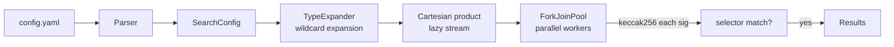

# sig-brute

[](LICENSE)
[](https://adoptium.net/)
[](https://github.com/tibetty/sig-brute/actions/workflows/ci.yml)

A parallel brute-force tool for recovering the exact canonical Ethereum/Solidity
function signature from a 4-byte ABI selector — including the concrete field types
inside `tuple` arguments that block explorers such as Etherscan cannot show.

## License

Licensed under the [Apache License 2.0](LICENSE). See [NOTICE](NOTICE) for
third-party attributions and [AUTHORS](AUTHORS) for contributor attribution
(including AI-assisted development).

## The problem this solves

When you inspect an unverified contract on Etherscan you may see something like:

```text
Function: dagSwapByOrderId(uint256 orderId, tuple baseRequest, tuple[] paths)
```

Etherscan knows the selector and the top-level argument layout, but `tuple` is
opaque — the ABI encoding does not carry field names or types. To reconstruct the
full canonical signature (needed for re-encoding calls, writing an interface, or
auditing the contract) you have to reverse-engineer what is inside each tuple.

sig-brute automates that last step.

> **Before you run sig-brute:** query a signature database first — it can answer
> in milliseconds and save you an expensive brute-force search entirely.
>
> ```bash
> # Preferred — Sourcify unified endpoint (~4.7 M signatures, most complete)
> curl -s "https://api.4byte.sourcify.dev/v1/signatures/?hex_signature=0xaabbccdd" \
>   | jq '.results[].text_signature'
>
> # Fallback — original 4byte.directory
> curl -s "https://www.4byte.directory/api/v1/signatures/?hex_signature=0xaabbccdd" \
>   | jq '.results[].text_signature'
> ```
>
> Only proceed to brute-force if both return no results, or none of the returned
> signatures match your decoded calldata structure.

## Recommended workflow

1. **Check [4byte.directory](https://www.4byte.directory/) first.** It indexes
   millions of known signatures. If the selector is already there with an
   unambiguous match, you are done — no brute-force needed.

2. **Decode the calldata.** From a transaction on Etherscan (or any ABI decoder),
   determine the number of arguments, which are tuples, and any constraints you can
   read from the encoded values (e.g. an address-shaped field, a small integer, a
   32-byte hash). The bundled [`decode` subcommand](#decoder-from-calldata-to-draft-yaml)
   does this mechanically — drop in an Etherscan dump and it emits a draft YAML.

3. **Write a sig-brute config.** Express what you know as method name candidates and
   per-field type wildcards. Use `():`/`"()[]":` keys to describe tuple structure.

4. **Run sig-brute.** It exhaustively hashes every candidate signature with
   Keccak-256 and reports any whose first four bytes match the target selector.

## How it works

Ethereum encodes function calls by taking the first 4 bytes of `keccak256` of the
canonical signature string — e.g. `transfer(address,uint256)` → `0xa9059cbb`.
sig-brute expands wildcard type patterns into every concrete ABI type, forms the
Cartesian product across all argument positions, hashes each combination in
parallel, and filters for selector matches.



## Requirements

- Java 17+
- Gradle 8+ (wrapper included)

## Build

```bash
./gradlew shadowJar
```

The fat JAR is produced at `build/libs/sig-brute-1.0.0-all.jar` (thin library JAR:
`sig-brute-1.0.0.jar` for Maven dependents — see [designs/public_api.md](designs/public_api.md)).

## Usage

```bash
java -jar build/libs/sig-brute-1.0.0-all.jar <config.yaml>              # brute-force search
java -jar build/libs/sig-brute-1.0.0-all.jar -                          # search, config from stdin
java -jar build/libs/sig-brute-1.0.0-all.jar --find-first <config.yaml> # stop at first match
java -jar build/libs/sig-brute-1.0.0-all.jar decode <calldata.txt>      # draft YAML from calldata
```

The `--find-first` flag overrides `find_first: false` in the YAML (equivalent to
`find_first: true`). In find-first mode the search runs sequentially in
type-frequency order so the most likely signatures are tried first.

Chain them to go from calldata to a match in one shot:

```bash
java -jar build/libs/sig-brute-1.0.0-all.jar decode calldata.txt \
  | java -jar build/libs/sig-brute-1.0.0-all.jar -
```

Example output:

```text
Method candidates : 2
Total search space: 64
Threads           : 8
Mode              : all matches

  64 / 64  (100.0%)

Checked 64 / 64 in 0.0 s — 1 match(es) found.

Matching signatures:
  transfer(address,uint256)
```

## Decoder — from calldata to draft YAML

Writing the config by hand means counting head/tail offsets, spotting which
slots are inline-static and which point to dynamic tails, then guessing types
from value shapes. The `decode` subcommand does all of that mechanically and
emits a sig-brute YAML you only need to refine.

```bash
java -jar build/libs/sig-brute-1.0.0-all.jar decode <calldata.txt>
java -jar build/libs/sig-brute-1.0.0-all.jar decode < calldata.txt   # or stdin
```

### Input formats

1. **Etherscan dump** — paste the "Function:", "MethodID:", and `[N]: <hex>`
   lines straight from a transaction's Input Data view. When the `Function:`
   line is present its top-level types are used as a skeleton: this resolves
   the static-vs-dynamic tuple ambiguity at the top level and lets the decoder
   correctly partition head slots between args.
2. **Raw hex** — a single hex string (with or without `0x`), optionally
   whitespace-separated. Without a skeleton the decoder uses pure heuristics.

### What gets emitted

Per-arg type candidates derived from value shape:

| Slot shape                                     | Emitted candidates                    | Notes                                                               |
| ---------------------------------------------- | ------------------------------------- | ------------------------------------------------------------------- |
| All 32 bytes zero                              | `uint*`, `address`, `bytes32`, `bool` | Any type's zero value is valid; `bool(false)` = all zeros           |
| Value == 1 (word\[31\] = 1, all others zero)   | `uint*`, `bool`                       | `bool(true)` and `uint8(1)` are identical encodings                 |
| Byte 0 non-zero, byte 31 also non-zero         | `bytes32`, `uint256`                  | Full-word left-aligned value                                        |
| Byte 0 non-zero, trailing zeros                | `bytes(lastNonZeroByte + 1)`          | Exact bytesN: e.g. `DEADBEEF00…` → `bytes4`                         |
| `firstNZ = 12`, ≥ 10 of 20 body bytes non-zero | `address`, `uint160+`                 | Keccak-derived address; floor covers `uint256`-typed address params |
| `firstNZ = 12`, < 10 of 20 body bytes non-zero | `address`, `uint160`                  | Sparse body — likely a small numeric cast to `uint160`              |
| `firstNZ` ≥ 13, value ≥ 2                      | `uintN+` (N = (32−firstNZ)×8)         | Minimum-bit-width floor; e.g. 28 leading zeros → `uint32+`          |
| `firstNZ` in 1–11 (large value)                | `uintN+`, `bytes32`                   | Large uint or raw 32-byte value                                     |

Tuple/array structure (number of fields, array element count, inline-static vs
dynamic encoding) is recovered exactly from offset arithmetic. Per-leaf type
choice is a guess — for tuple-array elements with mixed inner shapes the
decoder uses element[0] and flags the assumption in a comment.

### Example

```bash
java -jar build/libs/sig-brute-1.0.0-all.jar decode \
  src/main/resources/examples/calldata/dag_swap_by_order_id.calldata
```

That fixture is the Etherscan dump for `dagSwapByOrderId(uint256, tuple, tuple[])`.
The decoder identifies the inline-static `baseRequest` tuple (5 fields), the
dynamic `paths` tuple array (3 elements), and recursively decodes each path
element's structure into nested `()`/`"()[]":` mappings.

Truncated output (pipe directly to sig-brute):

```yaml
# Generated by sig-brute decode — review and refine before running.
# Method name is a guess; add alternates to method_names to broaden the search.
# Tighten or loosen the per-arg type candidates based on what you know.
#
# Recovered prototype (first candidate per leaf — wildcards collapsed):
#   dagSwapByOrderId(uint256,(address,address,uint256,uint256,uint256),(address[],address[],uint256[],(...)[],address)[])
# The structure (arg count, tuple/array nesting) is exact;
# the per-leaf type is a guess and is what sig-brute will brute-force.

selector: "0xf2c42696"
method_names: [dagSwapByOrderId]

args:
  # arg[0]: small uint 0x...
  - [uint256]

  # arg[1]: static tuple, 5 field(s)
  - ():
      - [address, uint160]
      - [address, uint160]
      - [uint*]
      - [uint*]
      - [uint*]

  # arg[2]: 3 elements; using element[0] structure
  - "()[]":
      ...
```

The `# Recovered prototype` comment is the quickest way to verify the structure
before handing the YAML to sig-brute. Fix the method name and tighten type
candidates based on what you know; everything else is ready to run.

### Limitations

- Per-slot type inference is a heuristic; `uint256` vs `bytes32`, `address` vs
  `uint160`, and `bytes` vs `string` are indistinguishable from the bytes alone.
- The decoder infers `bool` only for zero-valued and value-1 slots — the only two valid
  `bool` encodings. Any other value cannot be `bool` and the type is excluded. `int*` and
  fixed-point types are never inferred; add them to YAML candidates by hand if you know a
  parameter is signed or fixed-point.
- For `tuple[]` whose elements have different internal shapes (rare in
  practice), only element[0]'s shape is emitted. Review the calldata and
  broaden the YAML if needed.
- Without a `Function:` skeleton the decoder cannot tell an inline-static
  tuple's fields apart from sibling args; it emits each head slot as a
  top-level arg. Pass the Etherscan function line to get the right grouping.

## Config format

A machine-readable JSON Schema for the format lives at [`config-schema.yaml`](config-schema.yaml).

```yaml
selector: "0xaabbccdd"   # target 4-byte selector — quote 0x values (YAML would parse them as integers)
method_names: [transfer, safeTransfer]  # one name or a list

args:                    # one entry per argument position
  - [address, bytes20]   # bare list — simplest form
  - [uint*, int*]        # wildcards expand at search time

parallelism: 8           # worker threads (default: available CPU cores)
find_first: false        # true = stop at first match, false = find all
shard_index: 0          # optional: 0-based shard for multi-machine search (default: 0)
total_shards: 1         # optional: number of shards (default: 1)
```

### Multi-machine sharding

For very large search spaces, split work across machines with `shard_index` and
`total_shards`. Each shard scans a contiguous slice of the Cartesian product
(no overlap, full coverage). Run the same config on N hosts with indices
`0 … N-1` and merge results manually.

```yaml
shard_index: 2
total_shards: 5
```

### Flow sequences and array suffixes

`[address, uint*]` is a YAML flow sequence — compact and fine when no item contains `[]`.
When an item has an array suffix (`bytes*[]`, `address[]`), YAML parses the `[]` as a nested
empty sequence. Use block form instead:

```yaml
# OK — no [] in items
- [address, bytes20]
- [uint*, int*]

# Use block form when items contain []
- - bytes*[]
  - uint*[]
  - address[]
```

The `"[]":` / `"[N]":` key form is the canonical way to specify primitive array args — it also avoids the flow-sequence `[]` ambiguity:

```yaml
# "[]": key — cleaner for primitive array args (also avoids the [] ambiguity)
- "[]":
    - bytes*
    - address
```

### Type wildcards

| Pattern        | Expands to                                                    |
| -------------- | ------------------------------------------------------------- |
| `uint*`        | `uint8`, `uint16`, …, `uint256` (32 values)                   |
| `int*`         | `int8`, `int16`, …, `int256` (32 values)                      |
| `bytes*`       | `bytes1`, `bytes2`, …, `bytes32` (32 values)                  |
| `fixed*`       | all valid `fixedMxN` (M: 8…256 step 8, N: 1…80 — 2560 values) |
| `ufixed*`      | all valid `ufixedMxN` (2560 values)                           |
| `fixed*xN`     | `fixed8xN`, `fixed16xN`, … (M wildcard, fixed N)              |
| `fixedMx*`     | `fixedMx1`, `fixedMx2`, … (fixed M, N wildcard)               |
| `uint*[]`      | `uint8[]`, `uint16[]`, …, `uint256[]`                         |
| `uint`         | `uint256` (alias normalised)                                  |
| `int`          | `int256` (alias normalised)                                   |
| `fixed`        | `fixed128x18` (alias normalised)                              |
| `ufixed`       | `ufixed128x18` (alias normalised)                             |
| `byte`         | `bytes1` (alias normalised)                                   |
| Any exact type | returned as-is                                                |

### Tuple arguments

Use the `():` key with a list of field specs. Suffix the key with `[]` for a dynamic tuple-array or `[N]` for a fixed-size tuple-array. Quote any key that contains `[]` to prevent YAML from treating it as a nested empty sequence.

```yaml
args:
  # plain tuple — (address,uint256)
  - ():
      - [address]
      - [uint256]

  # dynamic tuple array — (address,uint256)[]
  - "()[]":
      - [address, bytes20]
      - [uint*, int*]

  # fixed-size tuple array — (address)[3]
  - "()[3]":
      - [address]
```

Fields inside the tuple value are themselves arg specs — bare lists or nested tuples.

## Examples

### ERC-20 transfer — `src/main/resources/examples/config/erc20_transfer.yaml`

```yaml
selector: "0xa9059cbb"
method_names: [transfer, safeTransfer]

args:
  - [address, bytes20]
  - [uint*, int*]

parallelism: 8
find_first: false
```

```bash
java -jar build/libs/sig-brute-1.0.0-all.jar src/main/resources/examples/config/erc20_transfer.yaml
```

Expected match: `transfer(address,uint256)`

### Tuple-array argument — `src/main/resources/examples/config/fill_orders.yaml`

```yaml
selector: "0x79530090"
method_names: [processOrders, executeOrders, fillOrders]

args:
  - "()[]":
      - [address, bytes20]
      - [uint*, int*]

  - [bytes*]

parallelism: 16
find_first: true
```

```bash
java -jar build/libs/sig-brute-1.0.0-all.jar src/main/resources/examples/config/fill_orders.yaml
```

Expected match: `fillOrders((address,uint256)[],bytes32)`

### Complex Superfluid signatures

The two examples below use signatures sourced from
[4byte.directory](https://www.4byte.directory/) to show what a real brute-force
config looks like once you know the selector but not the exact types.

| Example                                                           | Recovered signature                                                             | Selector     |
| ----------------------------------------------------------------- | ------------------------------------------------------------------------------- | ------------ |
| `src/main/resources/examples/config/superfluid_bulk_add_recipients.yaml` | `bulkAddRecipients(bytes32[],address[],(string,string,string,string,string)[])` | `0xd727784a` |
| `src/main/resources/examples/config/superfluid_gda_initialize.yaml`      | `initialize(address×7,(uint32,uint32,uint32),(string×5),address,address[])`     | `0x73a4859c` |

Both configs use wildcards and multiple method-name candidates — the typical
starting point when 4byte has no entry and you are working from partial knowledge
of the ABI. They cover **array of tuple**, **multiple tuples**, and **nested
tuples** (see `SearchEngineComplexSignatureTest`).

## Run tests

```bash
./gradlew test
```

## Project structure

```text
src/main/java/me/tibetty/sigbrute/
├── Main.java                    # entry point; dispatches search vs decode subcommands
├── decode/
│   ├── CalldataInput.java       # parses Etherscan dump / raw hex into selector + body
│   ├── AbiDecoder.java          # recursive head/tail decoder (heuristic + skeleton-guided)
│   ├── DecodedArg.java          # decoded-arg tree (Leaf / PrimArray / Tuple)
│   ├── DecodeMain.java          # entry point for the `decode` subcommand
│   ├── infer/
│   │   ├── SlotMeta.java            # pre-computed analysis of a single 32-byte ABI head slot
│   │   ├── SlotInferrer.java        # @FunctionalInterface — strategy for one slot shape
│   │   ├── ZeroSlotInferrer.java    # all-zero slot → broad candidate list
│   │   ├── ValueOneInferrer.java    # value == 1 → uint*/int*/ufixed*/fixed*/bool
│   │   ├── LeftAlignedInferrer.java # byte-0 non-zero → bytesN / negative-intN family
│   │   ├── AddressInferrer.java     # firstNonZero == 12 → address / uint160+
│   │   ├── RightAlignedUintInferrer.java  # remaining right-aligned slots → uintFloor / bytes32
│   │   └── TypeInferrer.java        # coordinator: builds SlotMeta, merges INFERRERS results
│   └── emit/
│       ├── PrototypeRenderer.java   # decoded tree → one-line Solidity prototype (shown in YAML header)
│       └── ConfigEmitter.java       # decoded tree → sig-brute YAML
├── expander/TypeExpander.java   # wildcard → concrete ABI type expansion
├── model/
│   ├── ArgSpec.java             # arg-spec interface
│   ├── LeafArgSpec.java         # candidates-based arg
│   ├── TupleArgSpec.java        # tuple arg (recursive)
│   └── SearchConfig.java        # parsed configuration record
├── parser/YamlConfigParser.java # YAML → SearchConfig
├── search/
│   ├── SearchEngine.java        # ForkJoinPool parallel search
│   └── SearchException.java
└── util/
    ├── CartesianProduct.java    # lazy combinatorial stream
    ├── HexUtil.java             # hex string ↔ byte[]
    └── Keccak256Util.java       # inline Keccak-256 (no external crypto dep)
```

## Dependencies

| Artifact                          | Version | Purpose             |
| --------------------------------- | ------- | ------------------- |
| `org.yaml:snakeyaml`              | 2.2     | YAML config parsing |
| `org.junit.jupiter:junit-jupiter` | 5.10.2  | unit tests          |

Keccak-256 is implemented inline; there is no Bouncy Castle dependency.

## Contributing

See [CONTRIBUTING.md](CONTRIBUTING.md). Bug reports and pull requests are welcome.

## Related projects

- [4byte.directory](https://www.4byte.directory/) — lookup known selectors before brute-forcing
- [sigbank](https://github.com/tintinweb/sigbank) — signature corpus used for type-frequency ranking
