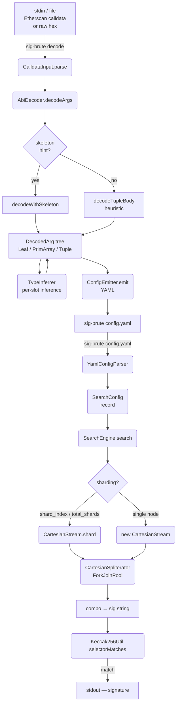
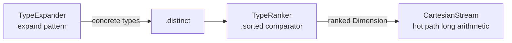

# sig-brute Developer Design Specification

- **Maintainers:** [tibetty](https://github.com/tibetty) (see [AUTHORS](../AUTHORS))
- **Audience:** Engineering contributors, Ethereum tooling practitioners
- **Status:** Living design document (public OSS)
- **Last reviewed:** 2026-05-23
- **Revision:** 2026-05-23 — decoder accuracy fixes (bytes[] detection, expanded array intersection, uint160+ for address slots), TypeExpander array suffix support, sequential `--find-first`; elapsed-time in search summary; TypeRanker tier corrections; `bool` inference added (zero and value-1 slots); skeleton-typed primitive-array decoding fix (`address[]`, `uint256[]`)

## Context and Goals

Etherscan and similar block explorers decode call data for verified contracts but stop at
the boundary of complex argument types. When a function takes a `tuple` or `tuple[]`, the
explorer shows the top-level argument names (e.g. `baseRequest tuple`, `paths tuple[]`) but
reveals no field names inside those tuples. Reconstructing the full function signature —
required for contract interaction, ABI generation, and reverse engineering — demands a
two-step workflow:

1. **Decode** the raw hex call data into a structural skeleton that captures argument count,
   nesting (tuple depth), array dimensions, and per-slot type constraints.
2. **Brute-force** candidate signatures by hashing every combination of plausible type
   substitutions with Keccak-256 and comparing the first four bytes against the known
   on-chain selector.

sig-brute implements both steps as a single CLI tool. The primary use case is Etherscan
tuple reverse-engineering: paste the decoder output, refine the emitted YAML, and run the
search.

### In scope

- `decode` subcommand: parse Etherscan-format call data text or raw hex into a typed
  argument tree and emit a ready-to-run YAML configuration.
- `search` subcommand (default, no keyword): load YAML and brute-force the selector using
  multi-threaded Keccak-256 hashing.
- Heuristic ABI type inference: left-alignment detection (bytesN family), minimum-bit-width
  narrowing (`uintN+` range patterns), address-shape detection.
- Unbounded Cartesian product iteration: mixed-radix odometer with no `Long.MAX_VALUE` cap
  on total space.
- In-process parallelism via ForkJoin: configurable thread count, work-stealing, binary
  Spliterator splitting.
- Multi-node sharding: contiguous equal-sized slices selectable by `shard_index` /
  `total_shards` YAML keys.
- Checkpoint/resume: snapshot current position as `long[]`, reconstruct stream from it.

### Out of scope

- Network calls or database lookups (no 4byte.directory, Etherscan API, or signature DB).
- Decompilation or disassembly of EVM bytecode.
- Solidity source parsing.
- `int*`, `fixed*`, `ufixed*` inference — the decoder never emits signed or fixed-point types; users must add `int*` / `fixed*` candidates to the YAML by hand.
- `bool` inference for values other than 0 and 1 — the decoder emits `bool` for zero slots and value-1 slots (the only valid bool encodings), but any other value cannot be `bool` and the type is excluded.

### Decisions already made

| Decision                                          | Rationale                                                                                         |
| ------------------------------------------------- | ------------------------------------------------------------------------------------------------- |
| Pure Java CLI, fat JAR via Shadow plugin          | Zero runtime dependencies; `java -jar sig-brute.jar` is the full install story                    |
| Java 17 (sealed interfaces, records, text blocks) | Sealed `ArgSpec` and `DecodedArg` hierarchies enforce exhaustive pattern matching                 |
| SnakeYAML 2.2 with `SafeConstructor`              | Only dependency; `SafeConstructor` prevents remote code execution via YAML                        |
| BigInteger only outside hot path                  | `long` arithmetic in `next()` / `tryAdvance()` keeps GC pressure minimal across ≥10^18 iterations |
| Emit YAML as the intermediate format              | User can inspect, edit, and version-control search parameters before committing to a long run     |

## Problem

### Current state

Before sig-brute, analysts facing an opaque Etherscan tuple call must:

1. Manually inspect hex slots to guess field boundaries.
2. Hand-compose a function signature string.
3. Hash it with a standalone Keccak-256 tool and compare against the selector.
4. Iterate — potentially thousands of times — adjusting field types by hand.

For non-trivial tuples (5+ fields, nested arrays) this is hours of work per signature, with
no systematic guarantee of finding the correct type mapping.

### Pain points

- **No structural decoder:** raw hex gives no indication of dynamic vs. static fields, tuple
  boundaries, or array element counts without manual offset arithmetic.
- **Exponential search space:** even a modest 4-argument function with unknown types has
  ~10^6 candidates. Naïve sequential search cannot finish in reasonable time.
- **Long overflow:** before the CartesianStream redesign the engine threw
  `SearchException("Total search space exceeds Long.MAX_VALUE")` for large inputs, making
  brute-force of complex tuples impossible.
- **No sharding:** a single JVM process cannot run for days without external coordination.
  There was no mechanism to split work across nodes.
- **Oversized candidate sets:** the old TypeInferrer returned up to 33 candidates per slot
  (the full `uint*` wildcard expansion) even when the slot value provably constrains the
  type to one or two possibilities.

## Architecture



### Package map

| Package                        | Responsibility                                                                                                  |
| ------------------------------ | --------------------------------------------------------------------------------------------------------------- |
| `me.tibetty.sigbrute`          | `Main` — CLI dispatch                                                                                           |
| `me.tibetty.sigbrute.decode`   | `CalldataInput`, `AbiDecoder`, `TypeInferrer`, `ConfigEmitter`, `PrototypeRenderer`, `DecodeMain`, `DecodedArg` |
| `me.tibetty.sigbrute.model`    | `ArgSpec` (sealed), `LeafArgSpec`, `TupleArgSpec`, `SearchConfig`                                               |
| `me.tibetty.sigbrute.parser`   | `YamlConfigParser`                                                                                              |
| `me.tibetty.sigbrute.search`   | `SearchEngine`, `SearchException`                                                                               |
| `me.tibetty.sigbrute.expander` | `TypeExpander`, `TypeRanker`                                                                                    |
| `me.tibetty.sigbrute.util`     | `CartesianStream`, `CartesianProduct`, `Dimension`, `Keccak256Util`, `HexUtil`                                  |

### Key data types

**`DecodedArg` (sealed interface)**

```text
DecodedArg
├── Leaf          — single head slot; carries List<String> candidates + comment
├── PrimArray     — T[] or T[N]; carries baseCandidates + arraySuffix
└── Tuple         — ()  or ()[N] or ()[]; carries List<DecodedArg> fields + arraySuffix
```

**`ArgSpec` (sealed interface)**

```text
ArgSpec
├── LeafArgSpec   — list of concrete/wildcard type strings; expand() → Dimension<String>
└── TupleArgSpec  — list of field ArgSpecs + arraySuffix; expand() → Dimension<String>
                    (cross-product of all field expansions, flattened to tuple strings)
```

**`Dimension<T>` (interface)**

```text
Dimension<T>
├── size() : long
└── get(long i) : T    — random access, zero-copy; backed by List or computed lazily
```

**`SearchConfig` (record)**

```text
selector       : byte[4]      — 4-byte function selector to match
methodNames    : List<String> — candidate base names to try (dimension 0 of search)
args           : List<ArgSpec>— per-arg type dimensions
parallelism    : int          — ForkJoinPool thread count (default: availableProcessors)
findFirst      : boolean      — stop after first match vs. collect all matches
shardIndex     : int          — 0-based shard index (default 0)
totalShards    : int          — total nodes in cluster (default 1)
```

## Decode subsystem

### `CalldataInput`

Parses two input formats:

1. **Etherscan annotated format** — lines beginning with `Function:`, `MethodID:`,
   `[N]:` are parsed to extract the method name, selector, top-level skeleton
   (`address`, `uint256`, `tuple`, `tuple[]`, …), and raw slot bytes.
2. **Raw hex** — `0x` prefix followed by raw call data. Selector is the first 4 bytes;
   no skeleton is available.

Output: `record CalldataInput(byte[] selector, String methodName, List<String> topLevelTypes, byte[] body)`.

### `AbiDecoder`

Two decoding paths, both producing a `List<DecodedArg>`:

**Skeleton-guided** (`decodeWithSkeleton`): used when Etherscan supplies the top-level type
list. The decoder assigns head slots to each top-level argument, resolves `tuple` slot counts
by comparing plausible offsets against the head region, then recurses into dynamic tail
sections.

**Free-form** (`decodeTupleBody`): used for nested bodies with no type hint. Scans for a
head/tail boundary by looking for slots whose uint value is a plausible byte offset into
the body (`>= headSize`, aligned to 32, within body bounds). Static slots are inferred
directly; offset slots are decoded recursively.

**Dynamic field decoding** (`decodeDynamicField`): interprets the first slot as either a
length prefix (bytes/string) or an element count (array). Falls back to a recursive
`decodeTupleBody` if neither heuristic matches.

**`bytes[]` vs `()[]` disambiguation** (`allElementsLookLikeBytes`): both `bytes[]` and
`()[]` use a dynamic-offset table. The decoder disambiguates them by checking whether every
element in the array satisfies the bytes-element invariant: the first 32-byte word is the
byte-length `L` and the element's total size equals `32 + ceil32(L)`. If all elements pass,
the field is decoded as a `PrimArray([bytes, string])` rather than a `Tuple` with phantom
sub-fields. This prevents a common misidentification where the length word of a `bytes`
element (e.g. `0x140 = 320`) is mistaken for a struct-field offset.

**Array element type intersection** (`mergeArrayElementCandidates`): when a `T[]` field has
multiple elements, their inferred type candidates are intersected across elements to find the
tightest type set consistent with all observed values. Intersection is performed on the
**expanded** concrete type sets (via `TypeExpander.expand`) rather than on the raw pattern
strings. This prevents the loss of valid candidates when element[0] infers `uint184+` and
element[1] infers `uint256`: a naive string intersection yields `{}`, while an expanded
intersection correctly yields `{uint184, uint192, …, uint256}`, compacted back to
`uint184+`.

### `TypeInferrer`

Heuristic ABI-type inference for a single 32-byte head slot, based on three rules:

**Rule 1 — Left-alignment (bytesN family)**

`bytesN` values are ABI-encoded left-aligned (data in the high bytes). `uint*`, `int*`, and
`address` are always right-aligned. Therefore:

- If byte 0 of the slot is non-zero the slot is definitively `bytesN`-shaped. The tightest
  fit is `bytes(lastNonZeroByte + 1)`.
- If all 32 bytes are occupied the slot is `bytes32` or `uint256` (2 candidates).

**Rule 2 — Minimum bit-width narrowing**

If the slot has `k` leading zero bytes, the value fits in `(32 − k) × 8` bits. A
`uintM` encoding with `M < (32 − k) × 8` is impossible for well-formed calldata. The
emitted pattern `uintN+` expands to `[uintN, uint(N+8), …, uint256]`.

**Rule 3 — Address entropy narrowing**

When `firstNonZero == 12` (classic address layout), the 20-byte body is examined for
entropy. Real Ethereum addresses are Keccak-256 pubkey hashes with ~19.9 / 20 non-zero
bytes on average. A practical `uint160` numeric value has far fewer non-zero bytes (e.g. a
timestamp cast has ~3). The threshold is 10 non-zero bytes out of 20:

- **≥ 10 non-zero bytes** (high entropy): return `[address, uint160+]`. The `address`
  candidate covers the 99.99% case. The `uint160+` floor pattern (`uint160, uint168, …,
  uint256`) covers the rare but valid case where a Solidity function declares a `uint256`
  parameter whose runtime value happens to be an address (e.g. a token address packed into a
  struct field typed as `uint256`). The `uint160(address)` cast pattern also falls here since
  its entropy matches the source address. P(false negative for real address) < 10^−11.
- **< 10 non-zero bytes** (sparse body): return `[address, uint160]` — could be a
  `uint160(small_value)` cast.

**Inference table**

| Slot shape                                           | Candidates                            | Typical count |
| ---------------------------------------------------- | ------------------------------------- | ------------- |
| All zeros                                            | `uint*`, `address`, `bytes32`, `bool` | 35            |
| Value == 1 (firstNZ = 31, word\[31\] = 1)            | `uint*`, `bool`                       | 33            |
| Left-aligned, trailing zeros                         | `bytes(lastNZ+1)`                     | 1             |
| Left-aligned, full word                              | `bytes32`, `uint256`                  | 2             |
| Address-shaped, high entropy (≥10/20 non-zero bytes) | `address`, `uint160+`                 | 14            |
| Address-shaped, low entropy (sparse body)            | `address`, `uint160`                  | 2             |
| Right-aligned, firstNZ ≥ 12, value ≥ 2               | `uintN+`                              | 1–25          |
| Large right-aligned, firstNZ 1–11                    | `uintN+`, `bytes32`                   | 3–13          |

**Typical search-space reduction example**

Function `(bytes32 hash, address to, uint64 amount)`:

- Old (pre-optimization, no inferrer): 33 × 2 × 32 = 2,112 candidates
- After Rules 1+2: 2 × 2 × 25 = 100 candidates (21× smaller)
- After Rule 3 (high-entropy address, new): 2 × **14** × 25 = 700 candidates — larger than
  the old `[address]` single-candidate outcome but correct: the 14-candidate floor covers
  `uint256`-typed address parameters that the single-candidate form would silently miss

### `ConfigEmitter` and `PrototypeRenderer`

`ConfigEmitter.emit(selector, methodName, args)` serialises a `List<DecodedArg>` to YAML
following the canonical schema (see YAML Schema section). It prepends a comment block with
the recovered prototype from `PrototypeRenderer.render()` — the first candidate per leaf,
wildcards collapsed to their canonical concrete form (e.g. `uint*` → `uint256`,
`uint64+` → `uint64`).

## Search engine

### `TypeRanker`

`TypeRanker` reorders any list of concrete ABI type names by their empirical frequency in
the on-chain signature corpus (sigbank / 4byte.directory, ~1 M distinct signatures). It is
applied inside `LeafArgSpec.expand()` after type expansion and deduplication so that the
`Dimension<String>` fed to the search engine visits the most-probable type first.

**Why it matters for `find_first`:** the `CartesianStream` odometer increments the
rightmost dimension fastest. When every leaf dimension is frequency-ordered, the first
combination tried is the statistically most-likely full signature — `uint256` before
`uint8`, `address` before `uint160`, `bytes32` before `bool`, etc. Expected time to the
first correct match drops proportionally to how well the prior matches the deployed
contract.

**Effect on all-matches:** ordering is a no-op for correctness; every candidate is still
visited. The total search space is unchanged.

**Frequency tiers (highest to lowest)**

| Group | Frequency      | Types                                                                                              | Rationale                                           |
| ----- | -------------- | -------------------------------------------------------------------------------------------------- | --------------------------------------------------- |
| A     | > 1 %          | `uint256`, `address`, `string`, `bytes32`, `bool`, `uint8`, `bytes`                                | Ubiquitous: ERC-20/721/1155 staples                 |
| B     | 0.1 %–1 %      | `uint16`, `uint32`, `uint64`, `uint128`, `int256`, `uint24`, `uint96`                              | Common DeFi / protocol types                        |
| C     | 0.01 %–0.1 %   | `bytes4`, `int24`, `int128`, `uint48`, `int32`, `uint40`, `bytes16`, `uint160`, `int8`, `int64`, … | Protocol-specific; bytesN family; raw address casts |
| D     | 0.001 %–0.01 % | `uint240`, `uint224`, `uint248`, `uint216`, `bytes5`, `bytes24`, `uint168`, …                      | Rare; specialized contracts                         |
| E     | < 0.001 %      | `int192`, `int56`, `int88`, `uint184`, `int40`, `int160`, `int240`, …                              | Corpus tail; seldom-used signed and wide types      |
| —     | 0 %            | `fixed128x18`, `ufixed128x18`                                                                      | Fixed-point: zero corpus occurrences                |

**`uint128+` convention for `find_first`:** for zero-value slots the decoder emits `uint*`
(34 candidates). Users who know a zero parameter is a "wide" value can manually write
`uint128+` in the YAML to reduce it to 17 candidates before ranking. This is a
user-declared narrowing, not an automatic one — the inferrer must remain conservative for
all-matches correctness.

**Architecture position**



### `CartesianStream<T>`

A stateful mixed-radix iterator (odometer) over a `List<Dimension<T>>`. Design contract:

- **Internal state:** `long[] indices` (current position per dimension) and
  `long[] sizes` (cloned from dims at construction time). Both are package-visible for use
  by `CartesianSpliterator`.
- **`next()` hot path:** pure `long` arithmetic — increment rightmost index, carry left
  (same algorithm as an odometer). No `BigInteger`, no allocation beyond the result list.
- **`BigInteger` usage:** only in `totalSize()`, `shard()` boundary arithmetic, and
  `CartesianSpliterator.trySplit()` midpoint computation (called at most O(log parallelism)
  times).
- **`remaining` field:** countdown of items to emit. `Long.MAX_VALUE` is the sentinel for
  "unlimited or space exceeds long range". The countdown path is skipped when this sentinel
  is active.

**Constructor variants**

| Constructor                                  | Use case                       |
| -------------------------------------------- | ------------------------------ |
| `CartesianStream(dims)`                      | Full scan from position zero   |
| `CartesianStream(dims, startIndices)`        | Resume from checkpoint         |
| `CartesianStream(dims, startIndices, limit)` | Shard with explicit item count |

**Checkpoint/resume**

```java
long[] saved = cs.snapshot();   // clone current indices
// persist saved[] to disk ...
var resumed = new CartesianStream<>(dims, saved);   // resume
```

**Multi-node sharding**

```java
// Node 2 of 5:
CartesianStream<String> cs = CartesianStream.shard(dims, 2, 5);
```

The total space is divided into contiguous equal-sized slices. The first
`total % totalShards` shards each receive one extra item, so coverage is always exact and
non-overlapping.

**Coordinate arithmetic (BigInteger ↔ mixed-radix)**

```text
toBigInteger(indices, sizes):  pos = Σ indices[i] × (Π sizes[j>i])
fromBigInteger(pos, sizes):    rightmost decomposition of pos in mixed-radix sizes
```

**`CartesianSpliterator<T>`**

Wraps the iterator as a `Spliterator` for ForkJoin parallel streams. `trySplit()` computes
the midpoint of the remaining range in BigInteger, clones the current `indices[]` as the
left half, and advances `this.indices` to the midpoint for the right half.
Characteristics: `ORDERED | IMMUTABLE | NONNULL`, plus `SIZED | SUBSIZED` when total count
fits in a `long`.

### `SearchEngine`

Execution flow:

1. Build dimension list: `[methodNames] + [args[i].expand()…]`.
2. Compute `BigInteger total = CartesianStream.totalSize(dimensions)`.
3. Print search-space summary (total, thread count, mode).
4. Create `CartesianStream<String>`: shard variant if `config.totalShards() > 1`, full scan
   otherwise.
5. **First-match mode (`findFirst=true`):** run a **sequential** `StreamSupport.stream(…,
   false)` and call `findFirst()`. Because TypeRanker has pre-ordered every dimension, the
   sequential stream visits the statistically most-probable combination first. `findFirst()`
   on a sequential stream terminates the moment the first Keccak-256 match is found.
6. **All-matches mode (`findFirst=false`):** submit `StreamSupport.stream(…, true)` to a
   private `ForkJoinPool` with `config.parallelism()` threads and collect all matching
   signatures with `toList()`.
7. Each element is mapped to a signature string `name(t1,t2,…)` then filtered by
   `Keccak256Util.selectorMatches(sig, selector)`.
8. A daemon progress thread wakes every second and prints `done / total (pct%)`. The final
   summary line includes elapsed wall-clock time: `Checked X / Y in Z.Z s — N match(es) found.`

**Why sequential for first-match?**  ForkJoin leaf tasks run their assigned range to
completion before checking for cancellation signals from sibling tasks. In an N-thread pool
the spliterator is bisected recursively, and the leaf containing the TypeRanker-optimal
position (typically ~0.5% of the space) is always assigned last via ForkJoin's LIFO
work-stealing. By the time that leaf processes the correct answer, all other leaves have
exhausted their ranges — resulting in ~99% of the space being checked before the match is
found. A sequential stream eliminates this pathology: `findFirst()` short-circuits at the
first matched element and incurs ~0.5% of the work a parallel scan would require.

**All-matches and sharding remain parallel.** The ~99% exhaustion issue only applies when
there is exactly one (or very few) matches and the correct type combination is at a low
TypeRanker index. For `find_first=false` every combination must be checked anyway, so
parallelism is purely beneficial.

**Default thread count (all-matches):** `Runtime.getRuntime().availableProcessors()` — all
logical CPUs. There is no upper cap; users running on 128-core machines will use all 128
threads unless they override `parallelism` in the YAML.

## YAML schema

```yaml

# Required

selector: "0xf2c42696"          # 4-byte function selector (hex string, 0x prefix)

method_names: [dagSwapByOrderId] # list of candidate base names; can be a bare string

# Required — one entry per top-level argument

args:
  - [uint*]                     # Leaf: bare list of type patterns

  - ():                         # Tuple (plain)

      - [address, uint160]
      - [uint32+]
  - "()[]":                     # Tuple array (dynamic)

      - [address]
      - [uint256]
  - "()[]":                     # Tuple (fixed array)

      - [bytes32]
  - "[]":                       # Primitive dynamic array

      - address
      - uint*
  - "[3]":                      # Primitive fixed array

      - uint256

# Optional

parallelism: 8                  # ForkJoinPool thread count (default: all CPUs)

find_first: true                # stop after first match (default: false)

shard_index: 0                  # 0-based; which shard this node handles (default: 0)

total_shards: 5                 # how many nodes share this run (default: 1)
```

### Type patterns

The floor (`+`) and ceiling (`-`) suffixes form a complementary pair. The decoder emits
only `+` patterns (it can infer a minimum bit width from leading zeros but never a
maximum). The `-` suffix is a user-declared hint in the YAML, expressing domain knowledge
about an upper bound on the type size.

| Pattern                 | Expansion                                                    | Count         | Source       |
| ----------------------- | ------------------------------------------------------------ | ------------- | ------------ |
| `uint*`                 | `uint8`, `uint16`, …, `uint256`                              | 32            | decoder/user |
| `uintN+`                | `uintN`, `uint(N+8)`, …, `uint256` (floor N)                 | (256−N)/8 + 1 | decoder      |
| `uintN-`                | `uint8`, `uint16`, …, `uintN` (ceiling N)                    | N/8           | user only    |
| `uintN+[]`              | `uintN[]`, `uint(N+8)[]`, …, `uint256[]` (array floor)       | (256−N)/8 + 1 | decoder      |
| `uintN-[M]`             | `uint8[M]`, `uint16[M]`, …, `uintN[M]` (fixed-array ceiling) | N/8           | user         |
| `int*`                  | `int8`, `int16`, …, `int256`                                 | 32            | user         |
| `bytes*`                | `bytes1`, `bytes2`, …, `bytes32`                             | 32            | decoder/user |
| `fixed*`                | all valid `fixedMxN` (M∈{8,16,…,256}, N∈{1,…,80})            | 2,560         | user         |
| `ufixed*`               | all valid `ufixedMxN`                                        | 2,560         | user         |
| `fixed*xN`              | `fixed8xN`, `fixed16xN`, …, `fixed256xN`                     | 32            | user         |
| `fixedMx*`              | `fixedMx1`, `fixedMx2`, …, `fixedMx80`                       | 80            | user         |
| `address`               | exact                                                        | 1             | decoder/user |
| `bool`                  | exact                                                        | 1             | user         |
| `bytesN` (1–32)         | exact                                                        | 1             | decoder/user |
| `uintN` (8–256, step 8) | exact                                                        | 1             | user         |

Array suffixes (`[]` or `[N]`) are stripped before pattern matching and re-appended to each
expanded type. This means `uint160+[]` expands correctly to
`[uint160[], uint168[], …, uint256[]]` (13 types), matching the `uint160+` base expansion.
Prior to this fix, `uint160+[]` was returned as the literal string `["uint160+[]"]` — an
invalid ABI type — causing those array candidates to never match any real signature.

**Floor / ceiling symmetry:** `uintN+` ∩ `uintN-` = `{uintN}` (they overlap only at N).
Their union covers `uint*`. Users can combine them by listing patterns:
`[uint32+, uint64-]` → after expansion and deduplication → `[uint32, uint40, uint48, uint56, uint64]`.

## CLI usage

**Decode subcommand**

```bash

# From Etherscan calldata (file)

sig-brute decode calldata.txt > config.yaml

# From stdin

pbpaste | sig-brute decode > config.yaml

# From raw hex

echo "0xa9059cbb000...3e8" | sig-brute decode > config.yaml
```

**Search subcommand**

```bash

# Single-node full scan

sig-brute config.yaml

# Stop on first match (overrides YAML find_first)

sig-brute --find-first config.yaml
sig-brute config.yaml --find-first   # flag position is flexible

# Stdin

sig-brute - < config.yaml

# Multi-node (5 nodes, node index 2)

# Set shard_index: 2 and total_shards: 5 in the YAML, then:

sig-brute shard2.yaml
```

**`--find-first` flag** — equivalent to setting `find_first: true` in the YAML, but applied
at invocation time without editing the config file. When both are present, CLI wins.

Exit codes: `0` = success (search completed or decode OK), `1` = error, `2` = empty input
(decode only).

> **Testability note:** `Main.main()` is a thin wrapper that calls `Main.run(args, out, err)`
> and passes the returned int to `System.exit()` only on non-zero. Tests invoke `run()`
> directly with captured `PrintStream` instances — no `System.setOut` needed.

## Migration phases

| Phase                            | Scope                                                                                                                                                                      | Status      |
| -------------------------------- | -------------------------------------------------------------------------------------------------------------------------------------------------------------------------- | ----------- |
| 1. CartesianStream               | Replace `Long.MAX_VALUE`-capped iterator; add BigInteger totals, sharding, Spliterator splitting                                                                           | Complete    |
| 2. TypeInferrer                  | Left-alignment + bit-width narrowing; `uintN+` pattern                                                                                                                     | Complete    |
| 3. Decode subcommand             | `CalldataInput`, `AbiDecoder`, `ConfigEmitter`, `DecodeMain`                                                                                                               | Complete    |
| 3b. Decoder accuracy             | `bytes[]` vs `()[]` disambiguation; expanded array element intersection; `uint160+` for high-entropy address slots; `uintN+[]` TypeExpander fix; sequential `--find-first` | Complete    |
| 3c. Decoder correctness          | `bool` inference for zero and value-1 slots; skeleton-typed primitive-array decoding (`address[]`, `uint256[]` no longer misidentified as `bytes`)                         | Complete    |
| 4. Checkpoint persistence        | Write `snapshot()` to disk; reload on restart                                                                                                                              | Not started |
| 5. Progress persistence          | Periodic checkpoint to survive JVM crashes during multi-day runs                                                                                                           | Not started |
| 6. `int` / fixed-point inference | Detect signed slots (two's-complement high bit) and `fixedMxN` shapes                                                                                                      | Not started |

## Constraints

- **Team / ops:** Small OSS project; CI runs `./gradlew test` on GitHub Actions (see `.github/workflows/ci.yml`).
- **Compliance:** No user data processed; no network calls; no compliance requirements.
- **Timeline:** No fixed deadlines. Multi-day brute-force runs are the primary operational mode.
- **Budget:** Runs on commodity hardware. Multi-node sharding designed for rented VMs, not Kubernetes.

## Stability contract

See **[public_api.md](public_api.md)** for the full Maven Central / JPMS export list, stability
tiers, and library usage examples.

- The YAML schema is the public API. Keys `selector`, `method_names`, `args`, `parallelism`,
  `find_first` are stable. `shard_index` and `total_shards` are stable from Phase 1.
- The `SearchConfig` 5-arg convenience constructor (`selector, methodNames, args, parallelism,
  findFirst`) remains available for existing tests and callers; new fields default to `0` / `1`.
- `CartesianStream` constructor signatures (1-arg, 2-arg, 3-arg) and `snapshot()` / `shard()`
  are stable public API.
- `TypeExpander.expand()` is stable. New patterns (e.g. `intN+`) may be added; existing ones
  never change their expansion set.

## Decision log

| #    | Decision                                                                     | Rationale                                                                                                                                                                               |
| ---- | ---------------------------------------------------------------------------- | --------------------------------------------------------------------------------------------------------------------------------------------------------------------------------------- |
| D-1  | Use mixed-radix `long[]` for hot path, BigInteger only for boundary          | Avoids GC churn across 10^18+ iterations; BigInteger cost is O(log p) total                                                                                                             |
| D-2  | `Long.MAX_VALUE` as "unlimited" sentinel in `remaining`                      | Avoids conditional branch per `next()` call in the ≤Long.MAX_VALUE regime                                                                                                               |
| D-3  | `uintN+` as a first-class TypeExpander pattern                               | Keeps emitted YAML human-readable and lets users see the floor constraint at a glance                                                                                                   |
| D-4  | Left-alignment detection before bit-width narrowing                          | The two rules are orthogonal; left-aligned slots skip all uint/address inference entirely                                                                                               |
| D-5  | Shard coverage by contiguous range (not round-robin)                         | Contiguous slices allow meaningful checkpoint/resume within a shard; round-robin cannot                                                                                                 |
| D-6  | Emit YAML with commented prototype                                           | Gives the user an immediate sanity-check of the structural decode before committing to search                                                                                           |
| D-7  | Address entropy threshold at ≥ 10 / 20 non-zero body bytes                   | P(false positive for real Keccak address) < 10^−11; safely eliminates uint160 candidate                                                                                                 |
| D-8  | TypeRanker applied always (not gated on find_first flag)                     | Ordering is a no-op for all-matches; avoids threading findFirst through ArgSpec.expand()                                                                                                |
| D-9  | TypeRanker lives in expander package, applied inside LeafArgSpec             | Single application point; TupleArgSpec composite strings are not rankable                                                                                                               |
| D-10 | `uintN-` is user-only; decoder never emits it                                | Decoder can infer floor (leading zeros → min bits) but not ceiling; ceiling requires domain knowledge                                                                                   |
| D-11 | High-entropy address slots return `[address, uint160+]` not just `[address]` | A `uint256`-typed function parameter can hold an address value at runtime; returning only `address` would silently exclude those signatures from the search space                       |
| D-12 | `--find-first` uses sequential stream, not parallel `findAny()`              | ForkJoin leaf tasks run to completion regardless of short-circuit signals; sequential stream genuinely terminates at the first TypeRanker-ordered match (~0.5% of space)                |
| D-13 | `uintN+[]` array suffix stripped before bound-marker check in `TypeExpander` | Allows the same floor/ceiling logic to work transparently for `T[]` and `T[N]` patterns without duplicating the expansion code                                                          |
| D-14 | Array element type intersection expanded before comparing, compacted after   | String-level intersection misses overlapping `uintN+` ranges across elements; expansion-then-intersection is the only correct approach; compaction back to `uintN+` keeps YAML readable |
| D-15 | Elapsed wall-clock time printed in search summary line                       | Allows users to benchmark throughput, estimate full-space cost, and compare runs across hardware without external timing wrappers                                                       |
| D-16 | Skeleton-typed primitive arrays decoded via dedicated path, not heuristics   | 1-element `address[]` encodes identically to `bytes` (payload=1); heuristic fires first and misidentifies. Skeleton element type is authoritative — bypass the heuristic entirely       |
| D-17 | `bool` added to zero-slot and value-1 candidates in `TypeInferrer`           | `bool` encodes as 0 or 1; without these candidates the decoder can never match signatures with `bool` params — a correctness gap, not a performance trade-off                           |

## Risk register

| Risk                                                                           | Likelihood | Impact | Mitigation                                                                                                                                                                                   |
| ------------------------------------------------------------------------------ | ---------- | ------ | -------------------------------------------------------------------------------------------------------------------------------------------------------------------------------------------- |
| JVM crash loses days of progress on a large shard                              | Medium     | High   | Phase 5: periodic checkpoint to disk; resume from last saved position                                                                                                                        |
| TypeInferrer incorrectly narrows candidates, excluding the true type           | Low        | High   | YAML override — user manually adds wider patterns; inferrer errs conservative not aggressive                                                                                                 |
| Sequential `--find-first` is slow when no match exists (bad YAML or wrong sig) | Low        | Medium | At ~1 M hashes/sec single-threaded (empirical on a 43 B item space), exhausting the full space takes ~12 h; users can fall back to `find_first: false` for parallel all-matches verification |
| ForkJoinPool starvation on heterogeneous hardware (all-matches mode)           | Low        | Medium | Configurable `parallelism`; users can tune down to leave headroom                                                                                                                            |
| Selector collision (two signatures share the same 4-byte prefix)               | Very low   | Low    | `find_first: false` collects all matches; user reviews manually                                                                                                                              |
| SnakeYAML CVE in future release                                                | Low        | Medium | Only dependency; monitor advisories; `SafeConstructor` disables remote-class execution                                                                                                       |

## Open questions

- Should checkpoint/resume (Phase 4) write the full YAML with an updated `shard_index`
  start position, or a separate checkpoint file that sig-brute reads alongside the config?
- Is `int*` narrowing worth implementing? Signed negative values have the high bit set,
  which is detectable. The candidate set reduction would be modest (at most 50% of uint
  range).
- Should the progress reporter output machine-readable JSON to a side channel so external
  orchestrators (e.g. a cron job across shard nodes) can aggregate progress?
- Multi-node coordination: should there be a helper script to split a YAML config into N
  shard configs automatically, or is manual `shard_index` / `total_shards` editing sufficient?

## Related documents

- `README.md` — installation, quick-start, Etherscan workflow walkthrough
- `src/main/resources/examples/dag_swap_by_order_id.calldata` — reference calldata fixture
  used in `AbiDecoderTest` and `DecodeMainTest`
- `src/test/java/me/tibetty/sigbrute/util/CartesianStreamTest.java` — coverage for
  sharding, checkpoint/resume, BigInteger round-trip
- `src/test/java/me/tibetty/sigbrute/decode/TypeInferrerTest.java` — inference rule
  coverage including `uintN+` narrowing cases
