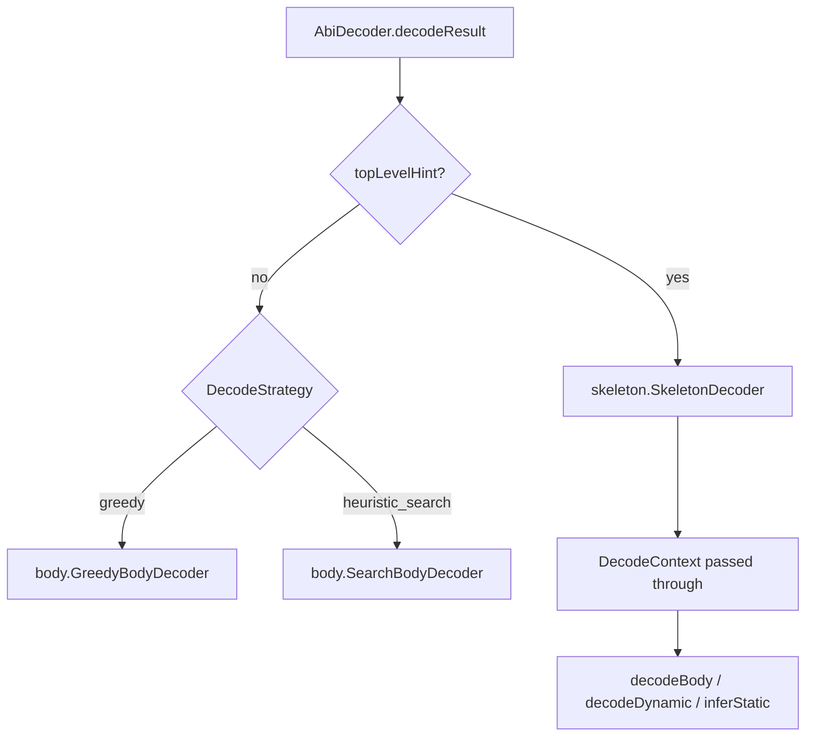

# Decode package layout

Source root: `src/main/java/me/tibetty/sigbrute/decode/`

```
decode/
├── AbiDecoder.java              # decodeArgs / decodeResult(body, hint [, strategy])
├── DecodeResult.java            # args + warnings + strategy
├── CalldataInput.java           # Parse Etherscan / raw hex input
├── DecodedArg.java              # Decoded tree (Leaf / PrimArray / Tuple)
├── SignatureStructure.java      # Structural compare for tests
├── DecodeMain.java              # CLI: sig-brute decode [--strategy …]
│
├── abi/                         # ABI primitives (words, offsets, type strings)
│   ├── AbiCodec.java
│   ├── AbiTypeSyntax.java
│   ├── UintPatternCompactor.java
│   └── ArraySuffixComposer.java
│
├── skeleton/                    # Skeleton-guided decode (Function: header present)
│   ├── SkeletonDecoder.java
│   ├── SkeletonLayout.java
│   ├── SkeletonArrayDecoder.java
│   ├── SkeletonInlineTupleDecoder.java
│   ├── SkeletonTypes.java
│   ├── SkeletonTypeKind.java
│   ├── SkeletonShape.java
│   └── AbiTypeView.java
│
├── layout/                      # Shared ABI layout (offset tables, head dyn slots)
│   ├── OffsetTable.java
│   └── DynamicHeadSlots.java
│
├── strategy/                    # Pluggable decode strategies
│   ├── DecodeStrategy.java      # enum: GREEDY | HEURISTIC_SEARCH
│   ├── DecodeContext.java       # explicit body + inferrer hooks + warnings
│   └── body/
│       ├── GreedyBodyDecoder.java
│       └── SearchBodyDecoder.java
│
├── infer/                       # Per-slot type candidates
│   ├── TypeInferrer.java        # Greedy path (full candidate lists)
│   ├── GeneralizedTypeInferrer.java   # Search path (floors / wildcards)
│   └── GeneralizedTypePatterns.java
│
└── emit/                        # YAML config emission
    ├── ConfigEmitter.java
    ├── PrototypeRenderer.java
    └── DecodeConfigValidator.java   # decode --validate
```

## Strategy flow



- **Greedy** — first-fit head/tail; `TypeInferrer` leaf candidates.
- **Heuristic search** — branch scoring on body parse; `GeneralizedTypeInferrer` emits `uintN+`, `bytesN+`, `int*`, `fixed*`, etc.

When to use which strategy, CLI flags, and decode→search workflow: [README § Choosing decode and search settings](../../../../../README.md#choosing-decode-and-search-settings).

## Imports (public API)

```java
import me.tibetty.sigbrute.decode.AbiDecoder;
import me.tibetty.sigbrute.decode.DecodeResult;
import me.tibetty.sigbrute.decode.strategy.DecodeStrategy;

DecodeResult result = AbiDecoder.decodeResult(body, hint, DecodeStrategy.HEURISTIC_SEARCH);
// result.args(), result.warnings(), result.strategy()
```

## Tests

`src/test/java/me/tibetty/sigbrute/decode/` mirrors the same package tree. `TupleCalldataCorpusTest`
runs each fixture under `GREEDY` and `HEURISTIC_SEARCH` with `CalldataInput.withoutSkeleton()`.
Integration tests for `AbiDecoder`, `CalldataInput`, and corpus fixtures stay in the `decode` root package;
unit tests live next to the code they exercise (`abi/`, `layout/`, `skeleton/`,
`strategy/` including `strategy/body/`, `infer/`, `emit/`). CLI lookup tests live under
`src/test/java/me/tibetty/sigbrute/lookup/`.
