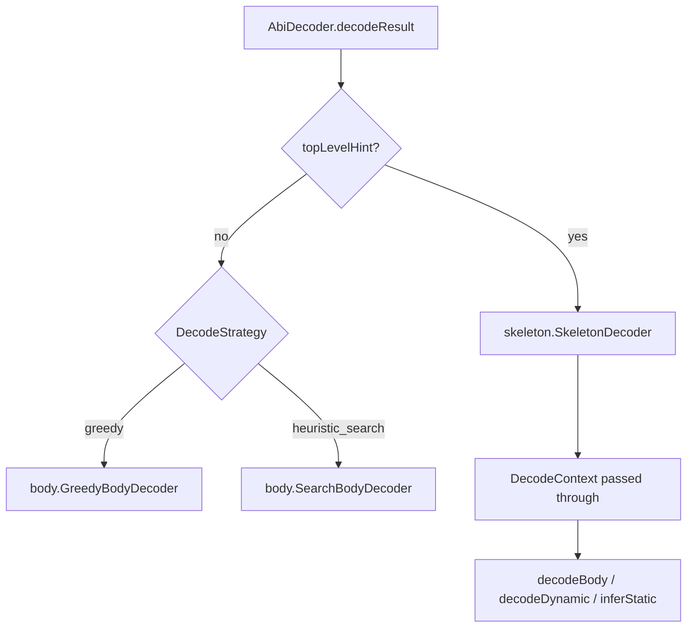

# Decode package layout

Source root: `src/main/java/me/tibetty/sigbrute/decode/`

```
decode/
├── AbiDecoder.java              # decodeArgs / decodeResult(body, hint [, strategy])
├── DecodeResult.java            # args + warnings + strategy
├── CalldataInput.java           # Parse Etherscan / raw hex input
├── ShallowSkeletonHints.java    # --shallow-skeleton: opaque top-level + layout/structure hints
├── DecodedArg.java              # Decoded tree (Leaf / PrimArray / Tuple)
├── SignatureStructure.java      # Structural compare for tests
├── DecodeMain.java              # CLI: sig-brute decode [--strategy …]
│
├── abi/                         # ABI primitives (words, offsets, type strings)
│   ├── AbiCodec.java
│   ├── AbiTypeSyntax.java
│   ├── UintPatternCompactor.java
│   └── ArraySuffixComposer.java
│
├── skeleton/                    # Skeleton-guided decode (Function: header present)
│   ├── SkeletonDecoder.java
│   ├── SkeletonLayout.java
│   ├── SkeletonArrayDecoder.java
│   ├── SkeletonInlineTupleDecoder.java
│   ├── SkeletonOnlyStaticTuplePartitioner.java
│   ├── SkeletonTypes.java
│   ├── SkeletonTypeKind.java
│   ├── SkeletonShape.java
│   └── AbiTypeView.java
│
├── layout/                      # Shared ABI layout (offset tables, head dyn slots)
│   ├── OffsetTable.java
│   └── DynamicHeadSlots.java
│
├── strategy/                    # Pluggable decode strategies
│   ├── DecodeStrategy.java      # enum: GREEDY | HEURISTIC_SEARCH
│   ├── DecodeContext.java       # explicit body + inferrer hooks + warnings
│   └── body/
│       ├── GreedyBodyDecoder.java
│       └── SearchBodyDecoder.java
│
├── infer/                       # Per-slot type candidates
│   ├── TypeInferrer.java        # Greedy path (full candidate lists)
│   ├── GeneralizedTypeInferrer.java   # Search path (floors / wildcards)
│   └── GeneralizedTypePatterns.java
│
└── emit/                        # YAML config emission
    ├── ConfigEmitter.java
    ├── PrototypeRenderer.java
    └── DecodeConfigValidator.java   # decode --validate
```

## Strategy flow



- **Greedy** — first-fit head/tail; `TypeInferrer` leaf candidates.
- **Heuristic search** — branch scoring on body parse; `GeneralizedTypeInferrer` emits `uintN+`, `bytesN+`, `int*`, `fixed*`, etc.

When to use which strategy, CLI flags, and decode→search workflow: [README § Choosing decode and search settings](../../../../../README.md#choosing-decode-and-search-settings).

## Strengths and weaknesses (honest assessment)

sig-brute’s decoder is built to produce **draft search YAML**, not to replace a verified ABI or
explorer UI. It separates **structure** (how many args, tuple nesting, array suffixes, head vs
tail layout) from **leaf types** (which `uintN`, `bytes` vs `string`, etc.). The two are not
equally reliable.

### What we measure

Optional regression tests use a local **300-fixture** tuple-heavy corpus
(`scratch/tuple-calldata-corpus/`, gitignored). Scores are **structural equality** against known
text signatures (`SignatureStructure`) — not whether every leaf candidate list is minimal or
correct for search. Report: `structure-check-shallow.json` (from
`TupleCorpusShallowSkeletonEvaluationTest`). CI skips these tests when the corpus is absent.

On that corpus, **greedy** and **heuristic_search** achieve the **same** nested match counts for
shallow/skeleton modes; strategy mainly changes **emitted type candidates** and warnings, not
this structural score.

### Strengths

| Area | What works well |
| ---- | ---------------- |
| **Full `Function:` skeleton** | With inline `(T,…)` types for layout **and** interiors: **300/300** nested structure match on the tuple corpus. This is the intended happy path for Etherscan paste + `decode`. |
| **ABI layout mechanics** | Offset tables, head/tail splits, dynamic vs static tuple heads, per-arg head bounds, and inline-static tuple field lists are driven by standard ABI rules once hints supply slot counts. |
| **Top-level shape** | Even in the hardest mode (skeleton-only: opaque `tuple` / `tuple[]` only), **300/300** top-level-only match — arg count, tuple vs leaf, and outer array suffixes are recovered. |
| **`--shallow-skeleton` (layout-only)** | `Function:` types used for **head layout** only; tuple interiors from calldata: **~256/300 (85%)** nested structure on the corpus. Good for RE-friendly YAML when the explorer line still has inline tuple **shapes**. |
| **Skeleton-only (`tuple` + `tuple[]`)** | Explorer-style hints with no inline field types: **~240/300 (80%)** nested structure. Static opaque `tuple` head partitioning (`SkeletonOnlyStaticTuplePartitioner`) and opaque `tuple[]` routing (`OPAQUE_TUPLE_ARRAY` / `decodeOpaqueTupleArray`) are the main enablers. |
| **Leaf candidates for search** | Per-word heuristics (`uint*`, `uintN+`, `bytesN`, `address`, `[bytes, string]` ambiguity) give sig-brute something to brute-force; `--shallow-skeleton` can preserve skeleton-pinned types (e.g. `bytes32`) when heuristics would drop them. |
| **Plumbing** | Warnings on stderr, `# Recovered prototype`, optional `--validate`, lookup before search — the tool is honest that output is a draft. |

### Weaknesses

| Area | Limitation |
| ---- | ------------ |
| **Leaf types are guesses** | From calldata alone, `uint256` vs `bytes32`, `address` vs `uint160`, and `bytes` vs `string` are often indistinguishable. Decode does not “know” the contract types. |
| **Structure without skeleton** | Without a trustworthy `Function:` line (or equivalent API hints), inline-static tuples can be split across head slots as separate args; grouping requires skeleton or manual YAML. |
| **Skeleton-only gap (~20%)** | **60/300** nested mismatches on the corpus: no inline types for layout **or** interiors. **~16** of those would pass if `Function:` supplied layout only (`layout_only_gap`); the rest overlap with shallow interior failures. |
| **Arrays inside tuple bodies** | Largest failure bucket (~35 fixtures): missing `[]` on dynamic arrays **nested inside** opaque tuples (not top-level `tuple[]`). Top-level `tuple[]` routing helps; inner `address[]` / `bytes[]` inside a decoded tuple body remains fragile. |
| **`tuple[]` element shape** | When elements disagree internally, decoders often assume **element[0]**’s shape (documented in comments). Homogeneous arrays work; heterogeneous ones need manual YAML. |
| **Multi-dimensional arrays** | `tuple[][]`, `uint256[][]`, and similar patterns are partial (e.g. `exodus`-style signatures still fail skeleton-only). |
| **Tuple vs leaf inside `tuple[]`** | Some fixtures decode a `tuple[]` element as a leaf instead of an inner tuple (`tuple_array_element` category). |
| **No multi-layout YAML** | `# Alternate structures` and search near-ties are comments only — one `args` tree per config file. |
| **Corpus coverage** | Benchmarks are tuple-heavy real calldata, not all of DeFi ABI space; scores are a regression guard, not a published accuracy claim for arbitrary selectors. |
| **End-to-end signature** | Recovering the **exact** canonical signature still requires lookup (4byte/Sourcify) or sig-brute **search** over type candidates — decode alone does not close that loop for skeleton-only input. |

### Mode summary (tuple corpus, nested structure)

| Mode | Nested match | Best for |
| ---- | ------------- | -------- |
| Full inline `Function:` | 300/300 (100%) | Production draft from Etherscan with full types |
| `opaque_only` (`--shallow-skeleton` + `Function:`) | ~256/300 (85%) | RE YAML; layout from explorer, interiors heuristic |
| `skeleton_only` (opaque `tuple` / `tuple[]` only) | ~240/300 (80%) | Explorer shows `foo(address,tuple,tuple[])` only |
| No skeleton (`--ignore-skeleton`) | Lower (see `TupleCalldataCorpusTest`) | Stress / corpus without header |

### Practical guidance

- Treat decode output as **structure-first**: trust nesting and `[]` suffixes more when skeleton
  hints are strong; trust leaf lines less everywhere.
- Prefer **signature lookup** before relying on skeleton-only decode for tuple-heavy calls.
- Use **`--shallow-skeleton` with `Function:`** when the line has inline tuple types but you
  want opaque top-level names — you gain ~16 corpus fixtures vs skeleton-only layout.
- Run **`SkeletonOnlyFailureAnalysisTest`** locally for categorized mismatch lists when tuning
  skeleton-only tuple / `tuple[]` paths.

## Shallow skeleton (`--shallow-skeleton`)

`CalldataInput.withShallowSkeleton()` abstracts each top-level inline `(T,…)` to `tuple` / `tuple[]`
for YAML and skeleton hint names. `DecodeMain` passes the original `Function:` types as
**layout** inline hint only; **interior** inline hint is empty so inner tuple fields are not
pinned from the signature:

| Hint | Purpose |
| ---- | ------- |
| `layoutInlineHint` → `ShallowSkeletonHints.layoutHints` | Correct head-slot counts (static vs dynamic tuples) |
| `interiorInlineHint` → `dynamicDecodeType` / `opaqueTupleFieldHints` | Empty under `--shallow-skeleton`; non-empty for full skeleton decode |
| Emitted YAML leaf candidates | Calldata heuristics (`[bytes, string]`, `uint*`, …) |

`SkeletonLayout.headBoundForSlot` prevents the global head scan from treating a nested tuple’s
offset table as the outer argument head (single dynamic `tuple` pointer at the top level).
`absorbRemainingSlack` and dynamic-offset registration use the same per-arg bound so inflated
head scans do not turn a tail pointer into a multi-slot static tuple.

Opaque top-level tuple decode (`SkeletonDecoder.decodeSkeletonTupleArg`) order:

1. Singleton fixed array `(bytes32[N])` → one `PrimArray` field
2. Plausible head offset → inline field hints on tail (or heuristic head/tail)
3. Static head span with inline field hints
4. Heuristic span, then per-slot inference fallback

Structural evaluation: `TupleCorpusShallowSkeletonEvaluationTest` (300 local corpus fixtures,
optional under `scratch/tuple-calldata-corpus/`). The JSON report has two modes:

| Mode | What it models |
| ---- | -------------- |
| `with_function_inline` | Layout **and** interior both use `Function:` inline types (library / regression) |
| `opaque_only` | CLI `--shallow-skeleton`: layout from `Function:`, empty interior (calldata heuristics inside tuples) |
| `skeleton_only` | Explorer-style opaque top-level types only; layout and decode from `tuple` / `address` hints |

`SkeletonOnlyImprovementRegressionTest` guards `opaque_only` and `skeleton_only` nested scores on the
local corpus (skips when absent). `SkeletonOnlyFailureAnalysisTest` prints a categorized mismatch
report for maintainers (never fails CI).

### When only opaque `tuple` is available (no inline `Function:` types)

Explorers often show `swap(tuple,bytes)` without inner tuple field types. In that case sig-brute
cannot pin `bytes` vs `string` or static head layout from the signature — inner decode uses
`GreedyBodyDecoder` / `SearchBodyDecoder` heuristics on the payload bytes.

**Recommended workflow**

1. **Lookup first** — `HttpSignatureLookup` / 4byte API may return the full text signature; if
   compatible, use it as the search config directly and skip brute-force on structure.
2. **Decode for a draft config** — `decode --shallow-skeleton` on calldata **without** a
   `Function:` line (or strip it) produces opaque top-level YAML; review `# field N` comments.
3. **Leaf candidates** — expect `[bytes, string]` ambiguity on dynamic payloads; keep both in
   YAML unless you know the type. `(type fixed by skeleton)` does not appear under
   `--shallow-skeleton` (interior inline hints are not passed).
4. **Strategy** — prefer `heuristic_search` on tuple-heavy opaque bodies; use `greedy` when the
   body is small and offsets are obvious.
5. **Manual refinement** — tighten wildcards (`uint64+` → `uint256`), add missing tuple nesting,
   or split merged fields before running search.
6. **Benchmark expectations** — see [Strengths and weaknesses](#strengths-and-weaknesses-honest-assessment)
   and `structure-check-shallow.json`.

**API / library:** mirror CLI shallow decode with layout + empty interior:

```java
var shallow = ShallowSkeletonHints.abstractTopLevelTypes(fullInlineTypes);
AbiDecoder.decodeResult(body, shallow, DecodeStrategy.HEURISTIC_SEARCH, false,
    fullInlineTypes, List.of());
```

Skeleton-only (no inline `Function:` types — layout and interior both opaque):

```java
AbiDecoder.decodeResult(body, shallow, DecodeStrategy.GREEDY, false, shallow, List.of());
```

Skeleton-only layout (`ShallowSkeletonHints.isSkeletonOnlyLayout`) enables:

| Component | Skeleton-only shape |
| --------- | ------------------- |
| `SkeletonOnlyStaticTuplePartitioner` | Consecutive static opaque `tuple` head runs (e.g. 2-slot tuple + `bytes32[67]`) |
| `SkeletonTypeKind.OPAQUE_TUPLE_ARRAY` → `SkeletonArrayDecoder.decodeOpaqueTupleArray` | Dynamic `tuple[]`, `tuple[][]`, … |
| `GreedyBodyDecoder.decodeBestHeadTailOpaqueTuple` | Opaque `tuple` interiors (score-gated head/tail) |

CLI equivalent: calldata input with selector + opaque top-level hints only (no inline `Function:` types).

## Imports (public API)

```java
import me.tibetty.sigbrute.decode.AbiDecoder;
import me.tibetty.sigbrute.decode.DecodeResult;
import me.tibetty.sigbrute.decode.strategy.DecodeStrategy;

DecodeResult result = AbiDecoder.decodeResult(body, hint, DecodeStrategy.HEURISTIC_SEARCH);
// result.args(), result.warnings(), result.strategy()
```

## Tests

`src/test/java/me/tibetty/sigbrute/decode/` mirrors the same package tree. `TupleCalldataCorpusTest`
runs each fixture under `GREEDY` and `HEURISTIC_SEARCH` with `CalldataInput.withoutSkeleton()`.
Integration tests for `AbiDecoder`, `CalldataInput`, and corpus fixtures stay in the `decode` root package;
unit tests live next to the code they exercise (`abi/`, `layout/`, `skeleton/`,
`strategy/` including `strategy/body/`, `infer/`, `emit/`). CLI lookup tests live under
`src/test/java/me/tibetty/sigbrute/lookup/`.
